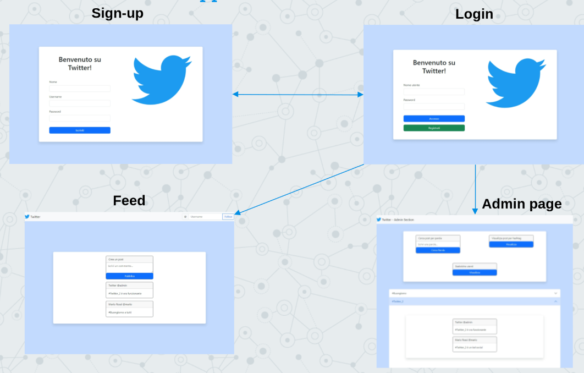

# Twitter 2
This project is a Twitter-like website developed in 2023 for the Programming 3 final exam.
It was developed using Java's WebSocket

## Functionalities
On this website every user can:
- Subscribe to the website
- Add a follower
- Send a message
- Visualize messages sent by the accounts the user follows

There is also an user with administrator privileges that can:
- List users by the number of messages sent
- List messages that use a specific hashtag
- List messages that contain a specific word

## Pages

## Copyright

This project is distributed under GNU General Public License v2.0
The project contains Twitter's name and logo. It is not affiliated in any way with Twitter, and they retain their right on the name and logo.
